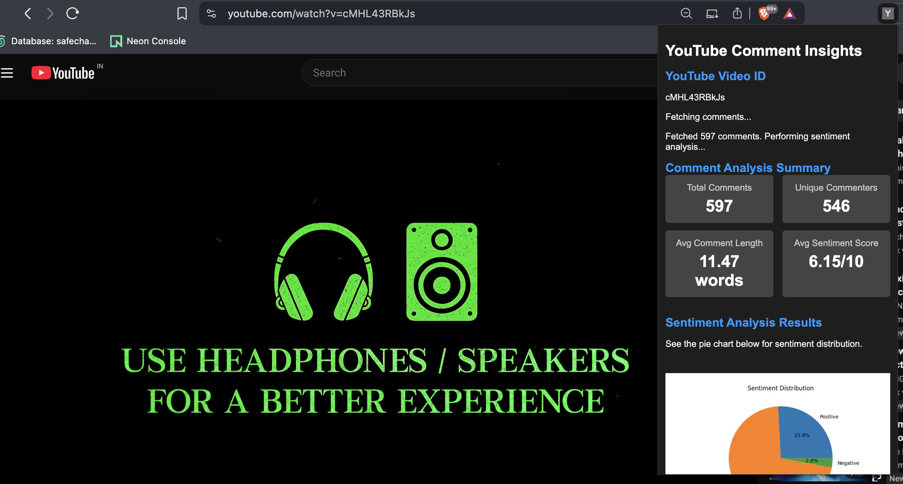
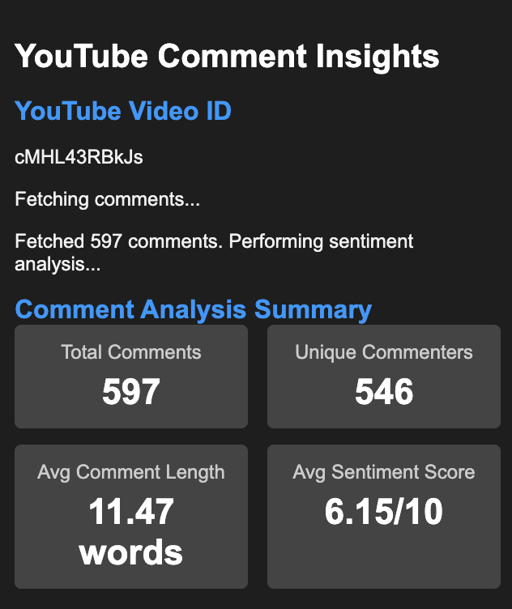
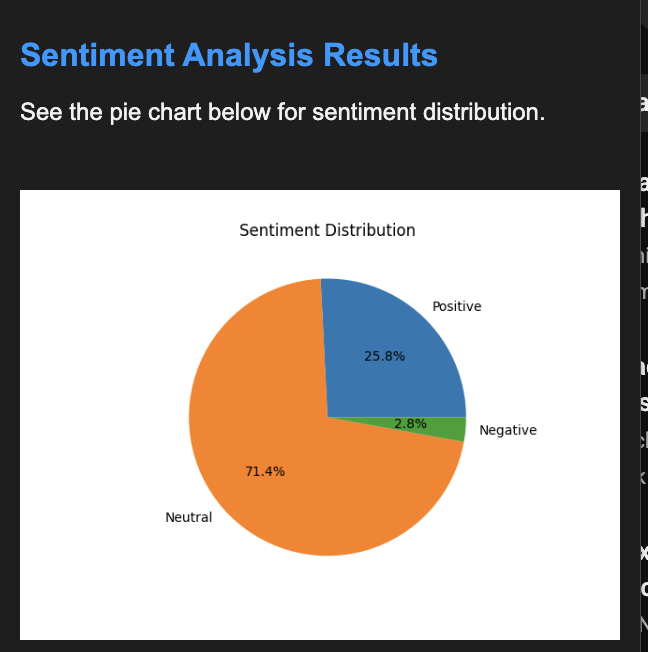
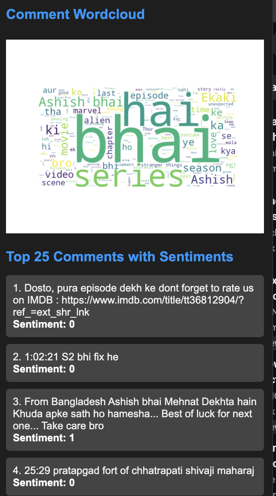

# 🚀 YTintel: YouTube Sentiment Insights & MLOps Pipeline

[](https://www.python.org/downloads/release/python-390/)
[](https://fastapi.tiangolo.com/)
[](https://scikit-learn.org/)
[](https://dvc.org/)
[](https://mlflow.org/)
[](https://www.docker.com/)
[](https://dagshub.com/)
[](https://opensource.org/licenses/MIT)

**YTintel** is a powerful End-to-End MLOps project that provides real-time sentiment analysis of YouTube comments. It combines a sleek Chrome extension frontend with a robust FastAPI backend, all managed through a professional data science lifecycle including automated pipelines, model versioning, and experiment tracking.

---

## 📺 Project Overivew

| extension_popup | analysis_results |
|:---:|:---:|
|  |  |

> [!TIP]
> **YTintel** doesn't just predict sentiment; it provides high-level insights like **Sentiment Trends Over Time**, **Word Clouds**, and **User Engagement Metrics** directly in your browser.

---

## 🛠 Tech Stack

### 🧠 Machine Learning & MLOps
- **LightGBM**: Gradient boosting framework for high-performance sentiment classification.
- **DVC (Data Version Control)**: Orchestrates the data engineering and model training pipeline.
- **MLflow**: Tracks experiments, metrics, and manages the model registry.
- **DagsHub**: Cloud-based storage for DVC remote and MLflow tracking.
- **Scikit-learn**: TF-IDF vectorization and evaluation utilities.

### 🌐 Backend & DevOps
- **FastAPI**: High-performance asynchronous API for real-time predictions.
- **Docker & Docker Compose**: Containerization for seamless deployment.
- **GitHub Actions**: CI/CD pipeline for automated linting and container builds.
- **Matplotlib/WordCloud**: Dynamic visualization generation on-demand.

### 🧩 Frontend
- **Chrome Extension (Manifest V3)**: Native browser integration.
- **YouTube Data API v3**: Efficient comment scraping.

---

## 🏗 Methodology: The MLOps Lifecycle

The project follows a rigorous engineering methodology to ensure model reproducibility and reliable deployment.

### 1. Data Pipeline (DVC)
Our entire workflow is modularized into stages defined in `dvc.yaml`:
- **Ingestion**: Automated fetching and splitting of training/test data.
- **Preprocessing**: Robust NLP cleaning (Lemmatization, stop-word removal, TF-IDF).
- **Training**: Optimized LightGBM model training with hyperparameter tracking.
- **Evaluation**: Comprehensive metric logging (Accuracy, Precision, Recall).

### 2. Experiment Tracking (MLflow)
Every run is logged to **MLflow** on DagsHub, capturing:
- **Parameters**: `n_estimators`, `max_depth`, `learning_rate`.
- **Metrics**: Validation performance.
- **Artifacts**: The serialized model (`lgbm_model.pkl`) and TF-IDF vectorizer.

---

## 📊 Performance & Insights

We achieve high-fidelity sentiment classification by addressing class imbalance and fine-tuning feature extraction.

### Model Evaluation
| distribution_chart | word_cloud |
|:---:|:---:|
|  |  |

The model is evaluated using a detailed confusion matrix to ensure balanced performance across **Positive**, **Neutral**, and **Negative** sentiments.

---

## 🚀 Getting Started

### Backend (Docker - Recommended)
```bash
# Clone the repository
git clone https://github.com/pprasoon1/YTintel-extension.git
cd YTintel-extension

# Start the API via Docker Compose
docker-compose up --build
```
The API serves at `http://localhost:8000`.

### Frontend (Chrome Extension)
1. Open Chrome and navigate to `chrome://extensions/`.
2. Enable **Developer mode**.
3. Click **Load unpacked**.
4. Select the `yt-chrome-plugin-frontend` folder.
5. Pin the extension and start analyzing!

---

## 🤝 Contributing
Contributions are welcome! Please feel free to submit a Pull Request.

## 📄 License
This project is licensed under the MIT License - see the [LICENSE](LICENSE) file for details.

---
Created with ❤️ by [Prasoon](https://github.com/pprasoon1)
